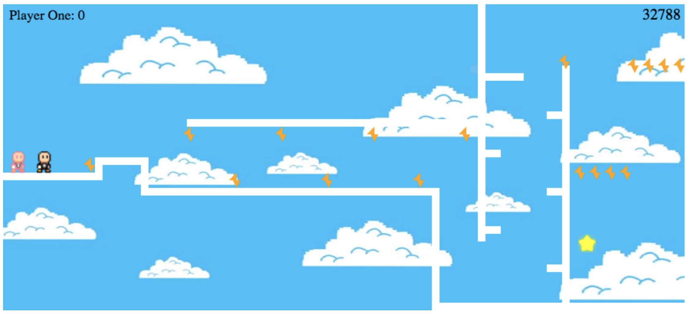
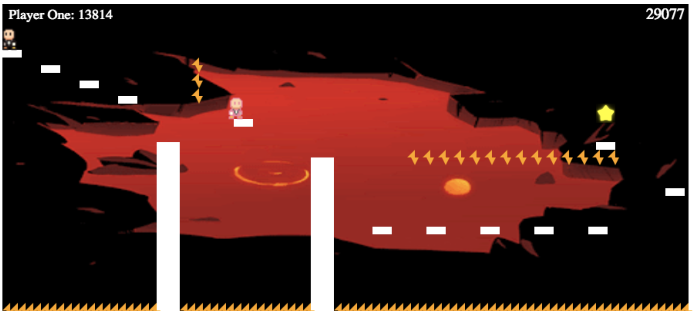
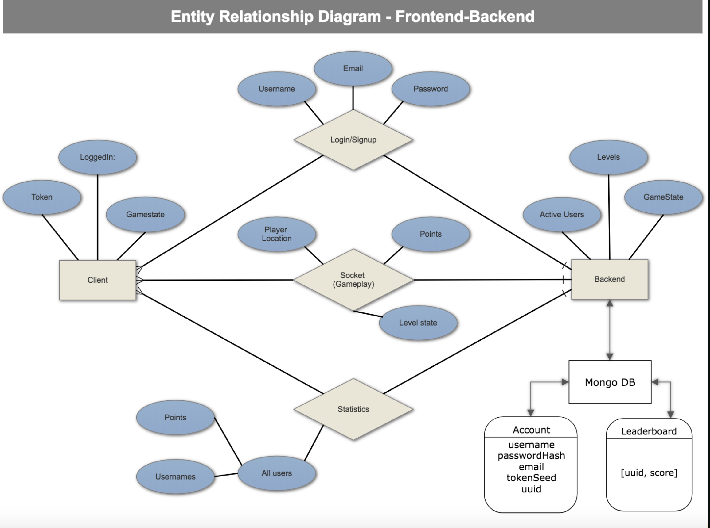

```

 ██████╗ ███████╗ ██████╗          ██╗██╗   ██╗███╗   ███╗██████╗ ███████╗██████╗ 
██╔════╝ ██╔════╝██╔═══██╗         ██║██║   ██║████╗ ████║██╔══██╗██╔════╝██╔══██╗
██║  ███╗█████╗  ██║   ██║         ██║██║   ██║██╔████╔██║██████╔╝█████╗  ██████╔╝
██║   ██║██╔══╝  ██║   ██║    ██   ██║██║   ██║██║╚██╔╝██║██╔═══╝ ██╔══╝  ██╔══██╗
╚██████╔╝███████╗╚██████╔╝    ╚█████╔╝╚██████╔╝██║ ╚═╝ ██║██║     ███████╗██║  ██║
 ╚═════╝ ╚══════╝ ╚═════╝      ╚════╝  ╚═════╝ ╚═╝     ╚═╝╚═╝     ╚══════╝╚═╝  ╚═╝
                                                                                  
```

# Frontend Application

#### `Staging` : [](https://travis-ci.org/geo-jumper/frontend)

#### `Master` : [](https://travis-ci.org/geo-jumper/frontend)

# Code Fellows: Seattle 401 JavaScript - 401d19

## Authors:
* Cameron Moorehead: https://github.com/CameronMoorehead
* Catherine Looper: https://github.com/ccloops
* Dalton Carr: https://github.com/hazzed
* Matt LeBlanc: https://github.com/Snobeard
* Jeff Kusowski: https://github.com/jjkusowski

### Sample Game Levels:





### Motivation

Geo-Jumper is a multiplayer fullstack platform game that combines socket.io with a frontend React library. This application is designed to create a unique game experience by matching online users to race to the finish line and be the first to catch the star. This application showcases a multiplayer/multi-level game and persists user data using MongoDB.

In this application, our team configured webpack to compile JavaScript and SASS into a bundle and configured babel to transpile JSX and ES6 to ES5 JavaScript. The application creates and renders React components to the DOM, adds event listeners to React components, and updates React component state.

---

### How to use?
#### To use the Geo-Jumper Game Application:

* Visit: https://geo-jumper-frontend.herokuapp.com/
* You can either create an account/login or play anonymously.
* Once you have either logged in or continued anonymously, you can select `Find Game`.
* You will then be entered into the waiting room, where you can hang out until an opponent is found.
* Once you have been paired, there will be a countdown from 5 and then you will join your opponent in Level 1.
* To score points, try and complete each level as quickly as you can. 
* To beat your opponent, try to race to the star first!

---

### Entity Relationship Diagram:

### Developer Tools:

* Step 1. Fork and Clone the Repository.
* Step 2. `npm install`.
* Step 3. touch a .env file and add the following environment variables:
```  
  PORT=3000
  NODE_ENV=production
  API_URL=http://localhost:3000
``` 


### If you would like to contribute:

* PR: If you would like to contribute to the Repo, please open a Pull Request and we will review it
* Bug Reporting: If you find a bug - please report it by opening up an issue in this git repository.

---

### Limitations
This app is developed as a Desktop application.

---
### Code Style
Standard JavaScript with ES6 Syntax.

### Tech/Framework used

* JavaScript / ES6
* Node.js
* jest
* enzyme
* enzyme-adapter-react-16
* eslint
* babel-core
* babel-loader
* babel-plugin-transform-object-rest-spread
* babel-preset-env
* babel-preset-react
* clean-webpack-plugin
* css-loader
* dotenv
* enzyme-to-json
* eslint-plugin-react
* express
* extract-text-webpack-plugin
* file-loader
* howler
* html-webpack-plugin
* node-sass
* react
* react-dom
* react-router-dom
* resolve-url-loader
* sass-loader
* serve-favicon
* socket.io
* socket.io-client
* style-loader
* superagent
* url-loader
* validator
* webpack
* webpack-dev-server

---
### Credits

* [Character Sheet - Gentleman Spy](https://opengameart.org/content/gentleman-spy-animated)
* Komiku - song title 'Ending' - for background music
* Juhani Junkala - sound effects - email: juhani.junkala@musician.org
* Code Fellows
* Heroku - for deployment
* Travis.ci - for continuous integration
* MongoDB - for persistence

---

### License

MIT © Geo-Jumper